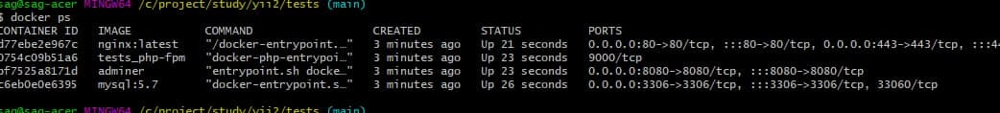
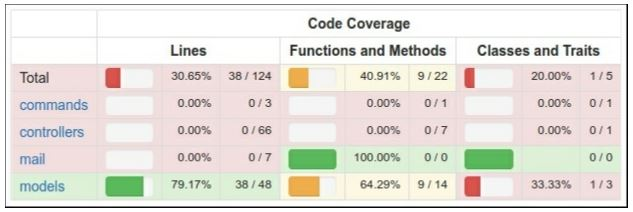

# Yii2 Tests, Codeception. PHP Unit

## Описание

### Тесты бывают :
1) Модульные (Unit/Integration)  
2) Функциональные (Functional)
3) Приёмочные (Acceptance)

Функуиональные отличаются от приёмочных тем что проверяют прилоджение не стартуя на сервере. 
Без эмуляции работы браузера.

Разработчики чаще пишут модульные. Приёмочные тесты удел тестировщиков.
Для компонента корзина надо создать корзину заполнить её элементами , удалить
Создать пустую корзину. Поместить в корзину null элемент.

### разворачиваем тестовую локальную среду из docker-compose:
    
    docker-compose up

В результате создаются контейнеры:

## Если мы хотим управлять, нужно выбрать контенер образа - tests_php-fpm 

В этом образе можно установить системные утилиты ткие как пинг и Midnight Commander
Заходим в консоль docker образа:
    
    docker ps (получить ID контейнера) 
    winpty docker exec -it <id_container> bash
    (winpty - это под Windows)

**Примечание**: Образ docker на базе DEBIAN 10.10.
Проверить версию

    cat /etc/debian_version

Необходимо пдополнительно установить пакет Midnight Commander и iputils-ping (для пинга)

    apt-get install mc -y
    apt-get install iputils-ping

Деинсталировать пакет - fxp/composer-asset-plugin, т.к. перешли на packagist 

    composer global remove fxp/composer-asset-plugin
    composer install

На всякий случай переход на packagist
В конфиг добавить:

        'aliases' => [
            '@bower' => '@vendor/bower-asset',
            '@npm'   => '@vendor/npm-asset',
        ],

и в composer.json:

        "repositories": [
            {
                "type": "composer",
                "url": "https://asset-packagist.org"
            }
        ]

## Настройка доступа к сайту через браузер

В файле hosts локальной машины нужно настроить
    
    127.0.0.1 deltrans.local 

### Сделать миграцию в тестовоу базу
Создайте yii2_basic_tests или другую тестовую базу данных и обновите ее, применив миграции:
Команда должна быть запущена в каталоге тестов. Параметры тестовой базы данных можно указать в файле конфигурации /config/test_db.php.
    
    tests/bin/yii migrate

### Модульные тесты (Unit)

Модульные тесты наследуют \Codeception\Test\Unit

Запустить тест MarkdownBehaviorTest (Windows) для Linux слеши в другую сторону
\vendor\bin\codecept run unit MarkdownBehaviorTest. Т.е. сам codeception запускаем из vendor

 Создать тест: 

    C:\project\study\yii2\tests\vendor\bin\codecept generate:test unit Example 

 Запустить тест:
    ПРИМЕЧАНИЕ: Конфигурационный файл для тестов - codeception.yml
                берётся из той папки из которой мы делаем запуск теста...
                для advanced шаблона его надо настраивать...

    C:\project\study\yii2\tests\vendor\bin\codecept run unit ExampleTest
    C:\project\study\yii2\tests\application\vendor\bin\codecept run
    
    
     /var/www/html/vendor/bin/codecept run unit --debug --steps

Здесь не всегда срабатывает (запуск через composer) и не всегда результат отображается на экране. 
поэтому лучше запускать через:
  
    C:\project\study\tests\vendor\bin\codecept run

### Adminer:
    
    Server: mysql
    Password: 123456qwerty
    dbname: project_db

### config/db.php
    
    'dsn' => 'mysql:host=mysql;dbname=project_db',
    
### run all available tests

    composer exec codecept run

### run functional tests

    composer exec codecept run functional

### run unit tests

    composer exec codecept run unit

### Проверка покрытя тестами кода проекта:

1) Нужно установить Coverage Driver это XDebug

        
    sudo apt-get install php7.4-xdebug

2) Настроить php.ini
    
    
    [xdebug]
    
    ;SAG!!!
    zend_extension_ts=C:/OSPanel/modules/php/PHP_7.3-x64/ext/php_xdebug.dll
    zend_extension=C:/OSPanel/modules/php/PHP_7.3-x64/ext/php_xdebug.dll
    ;SAG__

Настройки конфигурации codeception.yml:

    coverage:
        enabled: true
        whitelist:
            include:
                - models/*
                - controllers/*
                - commands/*
                - mail/*
        blacklist:
            include:
                - assets/*
                - config/*
                - runtime/*
                - vendor/*
                - views/*
                - web/*
                - tests/*

Запуск команды:

       C:\project\study\yii2\tests\vendor\bin\codecept run --coverage-html

Кроме того, вы можете видеть HTML-отчет в каталоге /tests/codeception/_output/coverage:

Вы можете нажать на любой класс и проанализировать, какие строки кода не были выполнены в процессе тестирования.

    composer require codeception/module-phpbrowser --dev
    
### Unit тесты синтаксис

#### ASSERTIONS
    
    $this->assertEquals()
    $this->assertContains()
    $this->assertFalse()
    $this->assertTrue()
    $this->assertNull()
    $this->assertEmpty()

    public function testLoginWrongPassword()
        {
            $this->model = new LoginForm([
                'username' => 'demo',
                'password' => 'wrong_password',
            ]);
    
            expect_not($this->model->login());
            expect_that(\Yii::$app->user->isGuest);
            expect($this->model->errors)->hasKey('password'); //в ошибках есть поле error
        }